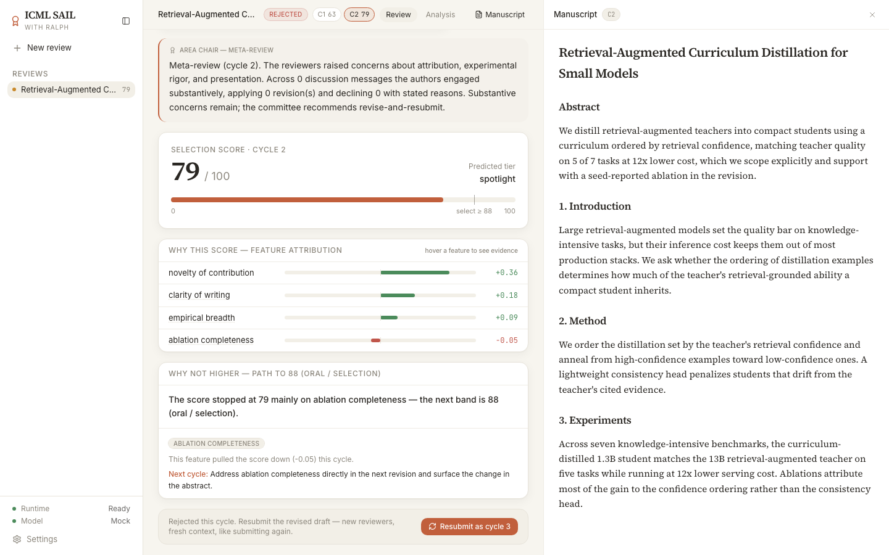
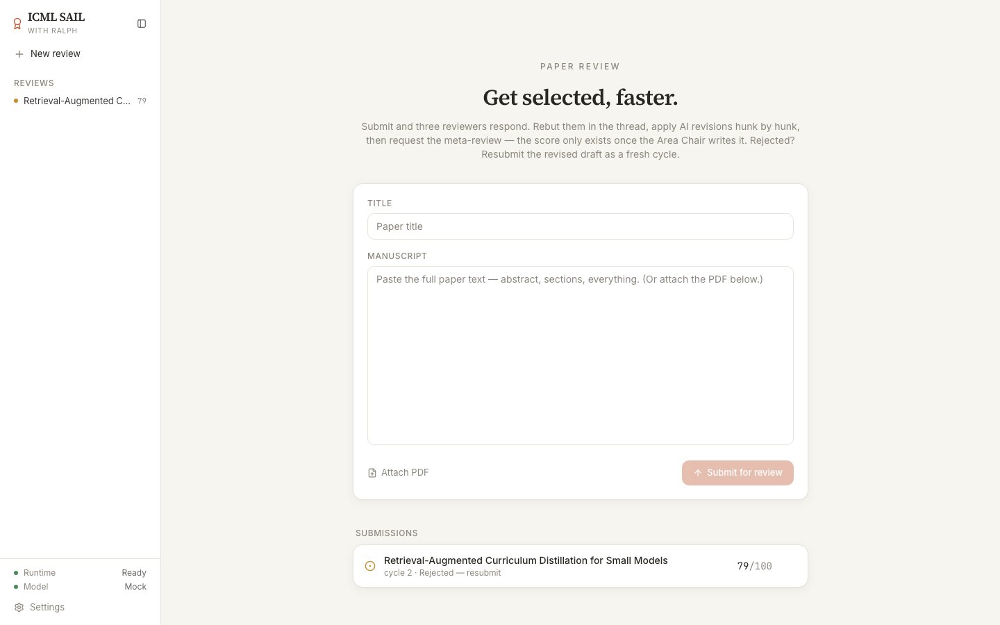
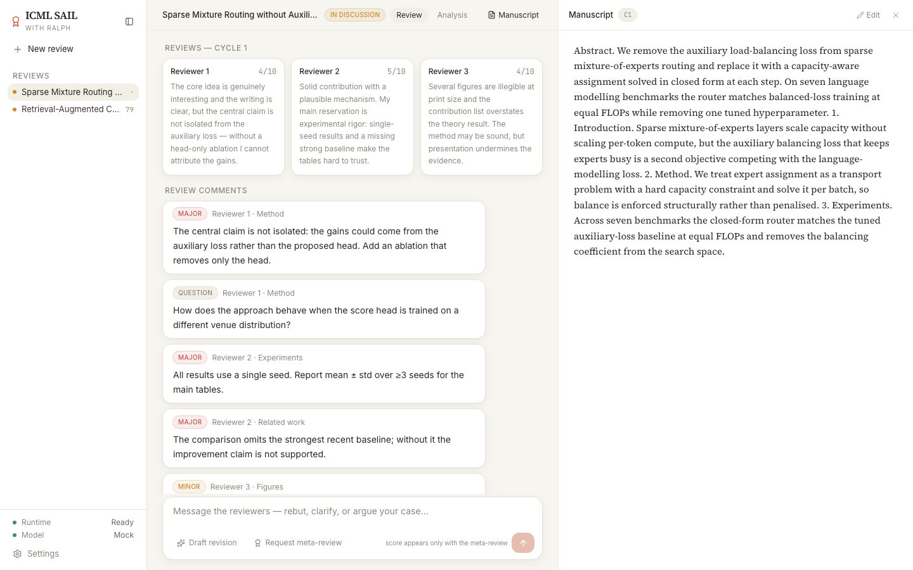
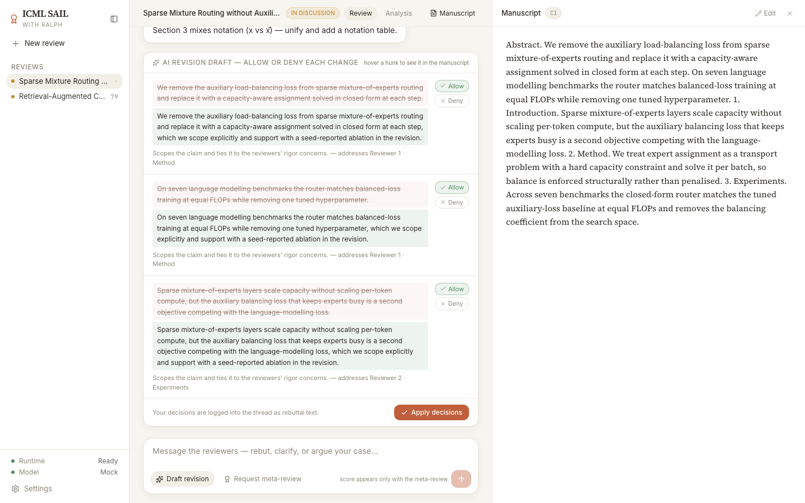
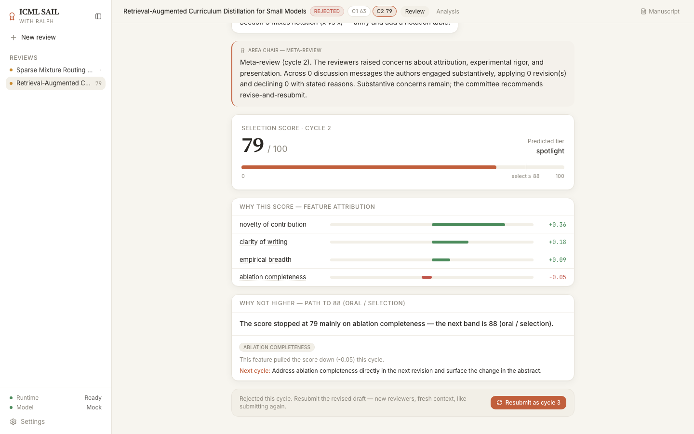
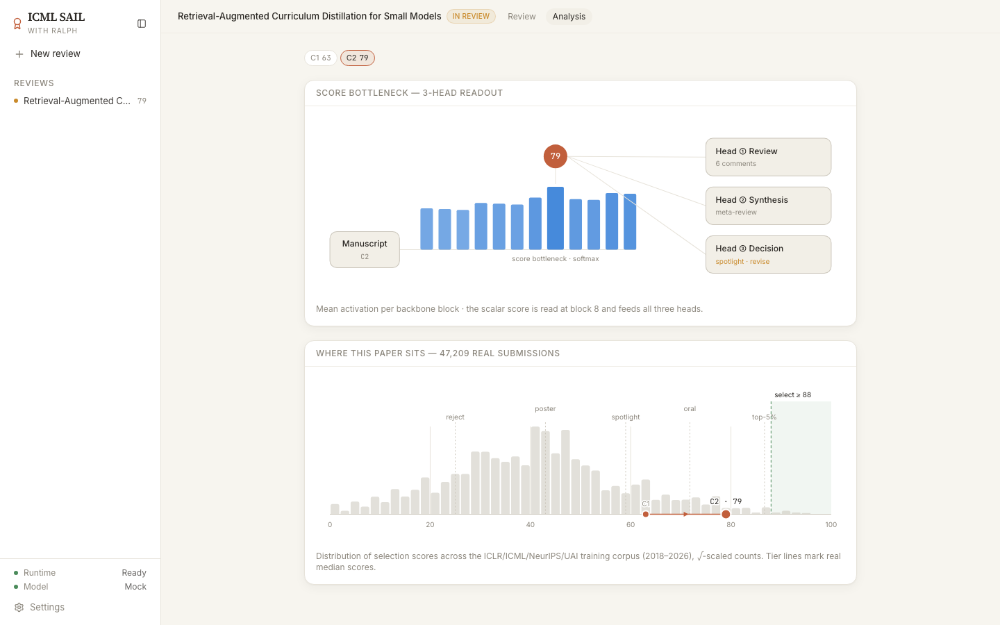
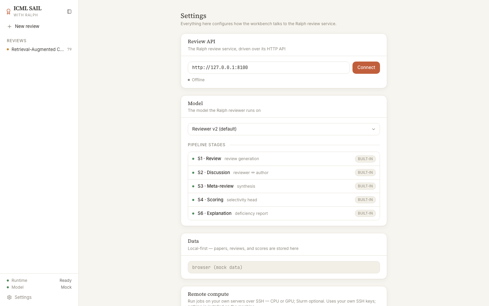

<h1 align="center">
   ICML SAIL <sub>with Ralph</sub>
</h1>

<p align="center">
  <a href="https://github.com/DanRo-AX/Ralphthon-ICML-SAIL"></a>
  
  
  
</p>

<p align="center">
  <strong>Get selected, faster.</strong><br/>
  An Area-Chair-style review agent that runs the real ICML loop instead of scoring a PDF.<br/>
  Submit, take three reviews, argue back in the thread, accept or reject each AI revision<br/>
  line by line — and only then ask for the meta-review. The score arrives with it, never before.
</p>

<h3 align="center"><a href="#run"><ins>Run it locally</ins></a></h3>

<p align="center">
  
</p>

## Features

<table>
<tr>
<td width="50%" valign="middle">

### Submit text or a PDF

Paste the whole paper, or attach the PDF and let the server extract it. Everything after this point is the venue's process, not a form.

Past submissions stay in the sidebar with their cycle and outcome.

</td>
<td width="50%">
  
</td>
</tr>
<tr>
<td width="50%" valign="middle">

### Three reviews, and no score yet

Cycle 1 comes back as three reviewers with 1–10 ratings and six or seven structured issues, each tagged major / minor / question and attributed to the reviewer and section who raised it.

There is deliberately no number on screen. A real submission does not have one at this stage either.

</td>
<td width="50%">
  
</td>
</tr>
<tr>
<td width="50%" valign="middle">

### Allow or deny each revision, one hunk at a time

"Draft revision" returns exact before/after spans with the reason and the comment each one answers. You take some and refuse others.

Your decisions are written back into the rebuttal thread as text, so declining is an argument on the record rather than a silent skip.

</td>
<td width="50%">
  
</td>
</tr>
<tr>
<td width="50%" valign="middle">

### The score exists only once the AC writes the meta-review

Request the meta-review and the Area Chair synthesises the reviews *and the whole discussion*. Only then do a 0–100 selection score, a predicted tier, and an accept/reject decision appear — together.

Attribution names what moved the number and by how much, and the deficiency report names the feature that capped this cycle, the band above it, and the change to make next time.

Rejected is not the end. Resubmit and the next cycle starts fresh on the revised draft: new reviewers, empty thread, like submitting to ICML again.

</td>
<td width="50%">
  
</td>
</tr>
<tr>
<td width="50%" valign="middle">

### Where your paper sits among 47,209 real ones

The Analysis tab shows the scalar score being read at backbone block 8 and fanning out to the review, synthesis, and decision heads.

Under it, the actual selection-score histogram of the ICLR/ICML/NeurIPS/UAI training corpus, with measured tier medians and your paper's cycle-by-cycle path across it.

</td>
<td width="50%">
  
</td>
</tr>
<tr>
<td width="50%" valign="middle">

### Local-first, and it shows you the data flow

Settings names each pipeline stage and the provider it runs on, and the privacy card states plainly what stays on the machine and exactly what leaves it during a review turn.

Papers, reviews, and provenance stay local. Nothing is sent in the background.

</td>
<td width="50%">
  
</td>
</tr>
</table>

**Also in the box**

- **Five named pipeline stages** — S1 review, S2 discussion, S3 meta-review, S4 scoring, S6 explanation. Settings shows which are built in and which provider each runs on.
- **History that survives a reboot** — mock mode persists whole papers, PDFs included, to IndexedDB. No backend required to explore the full flow.
- **Four languages and both themes** — English, 中文, 日本語, 한국어; light and dark, paper-toned.
- **Async agent jobs** — long server operations (`submit`, `reply`, `revision-draft`, `finalize`, `resubmit`) run as polled jobs, and the UI renders the live event stream of harness steps and thinking summaries.
- **Live-backend extras** — the Program Chairs' decision post, venue review-form facets (confidence / soundness / presentation / contribution), and a corpus-measured recency-calibration audit. The mock omits these and the UI tolerates their absence.
- **Remote and cloud compute** — run jobs over SSH on your own boxes, or on Modal with your own account. Desktop app only.

---

## How it works

```text
CYCLE n  =  one submission to the venue
  submit           → 3 reviewer reviews + structured comments      (no score)
  rebuttal thread  → per-comment replies, reviewer follow-ups,
                     hunk-level revision decisions logged as text  (no score)
  finalize         → AC meta-review written off reviews + the whole discussion
                     ↳ score, tier, attribution, deficiency, accept / reject
  resubmit         → CYCLE n+1 starts fresh on the revised manuscript
```

`src/api/reviewLoop.ts` is the single source of truth for that contract (v2). Every call
maps 1:1 onto the backend when `VITE_RALPH_API_URL` is set; otherwise the module simulates
the loop deterministically and persists to IndexedDB. Read its header before changing
anything on either side.

Selection threshold is **88**. Tiers are measured, not invented: reject below 60,
poster 60–77, spotlight 78–87, oral 88–94, notable-top-5% at 95 and above.

---

## Stack

| Layer | Choice |
|---|---|
| Framework | React 18 + TypeScript + Vite 8 |
| Styling | Tailwind CSS — paper-tone light/dark themes, alpha-capable `color-mix` tokens |
| UI state | **Recoil** (sidebar/inspector widths, theme, manuscript highlight) |
| Server state | **TanStack Query** (papers, cycles, scores, reviews, agent jobs) |
| Routing | react-router-dom |
| Icons / primitives | lucide-react, Radix UI |
| Local persistence | **IndexedDB** (mock mode) |

The UI is a pixel-faithful web port of the MIT-licensed
[Open Science Desktop](https://github.com/ai4s-research/open-science) — design tokens,
layout constants, interaction patterns. See `LICENSES/open-science-MIT.txt`.

---

## Run

```bash
npm install
npm run dev        # http://localhost:5199 — standalone on the built-in mock
```

Connect the real agent API with one env var (the mock is bypassed entirely):

```bash
echo 'VITE_RALPH_API_URL=http://localhost:8100' > .env.local   # 8000은 로컬 Sophy와 충돌
```

```bash
npm run build      # tsc -b && vite build
npm run lint       # oxlint
```

<details>
<summary><strong>실 어댑터 연결 메모 (2026-07-11, 백엔드 어댑터 v1 기준)</strong></summary>

- GCP 배포본: `http://8.230.3.211:8100` (GCE `sail-adapter` VM, `sweetspot-ax` /
  asia-northeast3-a, systemd `sail-adapter.service`, 상태 `/opt/sail/sail_state.json`).
  `VITE_RALPH_API_URL=http://8.230.3.211:8100` 로 바로 연결 가능.
- 어댑터: `serve/sail_adapter.py` (로컬 :8100) — 엔드포인트 계약 전부 구현, CORS 허용,
  `sail_state.json` 영속. **실 파이프라인 연결 완료**: Claude 리뷰어 3인 병렬
  (few-shot 스킬, 미서빙 헤드 대체) → VESSL v2 LoRA 메타리뷰+p_accept
  (`/meta-review`, 반론 히스토리는 `discussion`으로 전달) → 점수 = p_accept×100에
  양극단 완화 캘리브레이션(p^0.25) → Claude attribution 헤드(원문 verbatim 근거) →
  Claude revise 에이전트(원고 실제 재작성). 헤드별 독립 폴백(결정적 시뮬레이션).
- 제출 지연 ~20-40초, AI 수정 ~2-3분 (scoring 상태로 커버).
- **PDF 제출은 서버에서 텍스트 추출되어 `manuscript.kind: "text"`로 반환** (계약 상세는
  `src/api/reviewLoop.ts` 모듈 헤더가 단일 기준) — PDF embed가 필요해지면 PDF 서빙
  엔드포인트(GET .../papers/:id/pdf 등) 계약을 정해서 알려주세요.
- `score.attributions`는 v1에선 근사(코멘트 키워드→원고 문장 매칭), `layers`는 점수 연동
  근사값. 점수 캘리브레이션(양극단 완화)은 백엔드 후속 작업.

> 위 메모는 **contract v1(버전 레일 모델)** 시점 기록이다. 프론트는 현재 **contract v2
> (사이클 모델)** 이므로, 점수는 finalize 시점에만 존재하고 SELECT 판정은 별도 리뷰-턴
> 조건 없이 `score >= 88` 이다. 어댑터를 v2로 올릴 때 이 문단을 갱신할 것.

</details>

---

## Repository structure

```
src/
├── main.tsx                      RecoilRoot + QueryClient + Router + Theme
├── index.css                     design tokens (light/dark CSS variables)
├── data/
│   └── corpusDistribution.ts     REAL corpus histogram — 47,209 submissions
├── api/
│   ├── reviewLoop.ts             ★ contract v2 + mock simulation
│   ├── reviewLoopQueries.ts      TanStack Query hooks
│   └── loopStorage.ts            IndexedDB persistence (mock mode)
├── app/
│   ├── router.tsx                /review · /review/:id · /review/:id/analysis · /settings
│   ├── layout/AppShell.tsx       sidebar + outlet shell (⌘B collapse)
│   ├── providers/ThemeProvider.tsx
│   └── routes/
│       ├── ReviewLoopPage.tsx    ★ submit view + cycle view (reviews/thread/score)
│       ├── AnalysisPage.tsx      ★ bottleneck viz + corpus distribution
│       ├── SettingsPage.tsx
│       └── NotFound.tsx
├── components/
│   ├── review/ManuscriptPane.tsx right-hand manuscript (serif text / PDF embed, highlights)
│   ├── analysis/
│   │   ├── BottleneckDiagram.tsx 12 backbone blocks → score bottleneck → 3 heads (SVG)
│   │   ├── CorpusDistribution.tsx real-corpus histogram + this paper's path
│   │   └── ReviewTabs.tsx        Review | Analysis
│   ├── sidebar/                  brand lockup + New review + REVIEWS history
│   ├── settings/                 pipeline, data-flow, remote-compute cards
│   └── ui/                       Toaster, ConfirmDialog
└── lib/                          cn, Recoil store, platform shim, toast bus

serve/                            in-repo backend adapter (sail_adapter.py + Dockerfile)
sail-spec/                        the spec bundle this app was built from — contracts,
                                  UI units, ops runbooks, GPU plan, golden transcripts
```

---

## Data model

Reviews belong to a **cycle**, not to a chat timeline. One paper's full state:

```jsonc
{
  "id": "lp_1",
  "title": "…",
  "status": "in_discussion",         // in_discussion | decided
  "currentCycle": 2,
  "cycles": [
    {
      "cycle": 1,
      "manuscript": { "kind": "text" | "pdf", "text": "…", "fileName": "paper.pdf" },
      "reviews": [                   // S1 — three reviewers, ICML-style 1–10
        { "id": "lp_1_cy1_r0", "reviewer": "Reviewer 1", "rating": 7, "summary": "…",
          "body": "…", "confidence": 4, "soundness": 3 }   // facets: live backend only
      ],
      "comments": [                  // the anchors replies and revisions point at
        { "id": "lp_1_cy1_c0", "cycle": 1, "reviewer": "Reviewer 1",
          "severity": "major",       // major | minor | question
          "section": "Method", "body": "…" }
      ],
      "thread": [                    // S2 — the rebuttal discussion
        { "id": "m1", "role": "author", "author": "You", "body": "…",
          "replyTo": "lp_1_cy1_c0",  // a comment id, or another message id
          "attachment": "revised-draft", "createdAt": "…" }
      ],
      "pendingRevision": {           // awaiting per-hunk decisions
        "hunks": [{ "id": "h0", "before": "…", "after": "…",
                    "rationale": "…", "commentIds": ["lp_1_cy1_c0"],
                    "decision": "allowed" }]
      },
      "draftManuscript": "…",        // applied hunks + manual edits → seeds the next cycle
      "revisionNote": "…",           // the allow/deny log, pre-filled into the composer

      // everything below is written at finalize, together, never before:
      "metaReview": "…",             // S3 — AC synthesis of reviews + discussion
      "score": {                     // S4
        "cycle": 1, "score": 63, "selectThreshold": 88,
        "gradeTier": "poster",       // reject|poster|spotlight|oral|notable-top-5%
        "attributions": [{ "feature": "ablation completeness", "weight": -0.31,
                           "evidence": ["a real sentence from the manuscript…"] }],
        "layers": [0.28, …]          // 12 backbone activations, for the bottleneck viz
      },
      "decision": "reject",          // accept | reject
      "deficiency": {                // S6 — what capped it, and what to change
        "headline": "…", "targetBand": "88 (oral / selection)",
        "items": [{ "feature": "…", "why": "…", "action": "…" }]
      }
    }
  ]
}
```

### Endpoints (live backend)

| Method | Path | Role |
|---|---|---|
| POST | `/api/loop/papers` | Submit → cycle 1 reviews (multipart: title, text?/file?) |
| GET | `/api/loop/papers` | Submissions list |
| GET | `/api/loop/papers/:id` | Full loop state (the JSON above) |
| POST | `/api/loop/papers/:id/reply` | Post an author message / per-comment reply |
| POST | `/api/loop/papers/:id/revision-draft` | Ask for AI revision hunks |
| POST | `/api/loop/papers/:id/revision-apply` | Allow/deny each hunk |
| POST | `/api/loop/papers/:id/manuscript` | Manual manuscript edit |
| DELETE | `/api/loop/papers/:id/draft` | Discard the pending revised draft |
| POST | `/api/loop/papers/:id/finalize` | Write the meta-review → score + decision |
| POST | `/api/loop/papers/:id/resubmit` | Start the next cycle on the revised draft |
| GET/POST | `/api/loop/papers/:id/jobs`, `/api/loop/jobs/:jobId` | Async agent jobs + event stream |

### Local storage (mock mode)

IndexedDB `sail-ralph`, object store `papers`, keyed on `paper.id`. Each record is the
whole paper plus the uploaded **PDF blobs** per cycle. Written on every submit, reply, and
revision; hydrated at startup, so history survives a reload or a reboot. Object URLs are
session-scoped, so they are stripped on save and reissued from the blob on load.
IndexedDB was chosen over localStorage because full texts and PDFs blow past the 5MB cap;
where storage is unavailable (private windows) it degrades to memory.

### Corpus statistics

The Analysis histogram is not mocked. `src/data/corpusDistribution.ts` bakes the
`selectivity_target × 100` distribution of the training corpus `train_pairs.csv`
(ICLR/ICML/NeurIPS/UAI, 2018–2026, **47,209 submissions**) into 50 bins, alongside the
measured median score of each grade tier.

---

## Mock behaviour

Without a backend the whole flow still runs, deterministically. Cycle scores follow
**63 → 79 → 91 → 96**, so a paper is rejected twice and then selected on cycle 3, and can
keep going into the best-paper band. Reviews and structured comments are generated for
every cycle; the meta-review only ever appears at finalize and reports the real counts —
how many discussion messages, how many revisions applied, how many declined. Revision
hunks are cut from the actual sentences of your manuscript, and attribution evidence is
extracted from it by per-feature keywords, so the highlights point at text you wrote.
